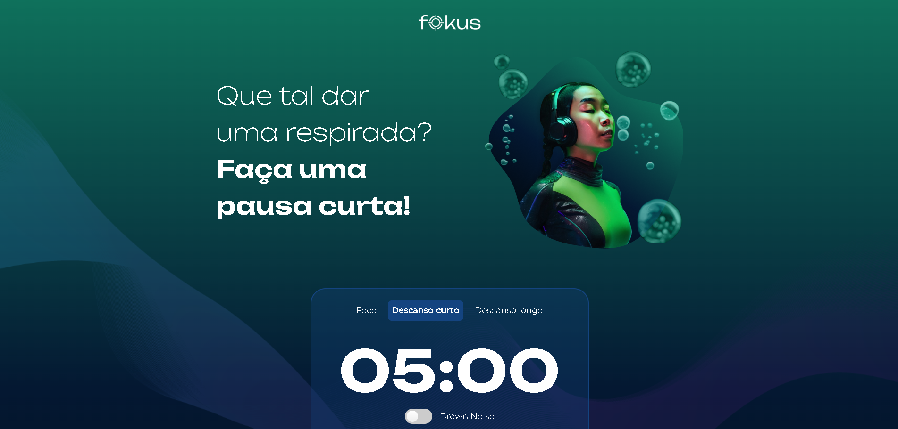

# 🎯 Fokus

O **Fokus** é um projeto web simples desenvolvido com **JavaScript**, **HTML** e **CSS**, criado **exclusivamente para fins de estudo**. Seu objetivo principal é servir como prática de desenvolvimento front-end, especialmente no uso de JavaScript para manipulação do DOM e armazenamento de dados no navegador através do **LocalStorage**.

Inspirado na **técnica Pomodoro**, o Fokus ajuda a organizar os estudos em ciclos de 25 minutos de foco, intercalados com pausas curtas e longas.

  

---

## 🌱 Sobre a técnica Pomodoro
A técnica Pomodoro consiste em dividir o tempo de estudo ou trabalho em períodos de foco de 25 minutos, separados por pausas curtas de 5 minutos. Após alguns ciclos, é feita uma pausa mais longa, geralmente de 15 minutos. Essa abordagem visa aumentar a produtividade, manter a mente descansada e reduzir a fadiga.

---

## 🚀 Funcionalidades
✅ Temporizador com três modos pré-definidos:
- **Foco (25 minutos)**
- **Descanso curto (5 minutos)**
- **Descanso longo (15 minutos)**

✅ Opção para definir manualmente o tempo de estudo ou pausa

✅ Área para gerenciamento de tarefas:
- Adicionar tarefas
- Editar tarefas
- Excluir apenas tarefas concluídas ou todas as tarefas
- Marcação automática como concluída ao fim de um ciclo

✅ Reprodução de **Brown Noise**, um tipo de ruído que auxilia na concentração

✅ Interface simples e fácil de usar

---

## ⚙️ Tecnologias utilizadas
- HTML
- CSS
- JavaScript

Com foco em:
- Manipulação dinâmica do DOM (`document.querySelector` e outros)
- Atualização de elementos HTML em tempo real
- Armazenamento local de dados usando **LocalStorage**

---

## 📌 Objetivo do projeto
Este projeto foi desenvolvido **apenas para fins educacionais** e prática pessoal, sem intenção comercial. Seu objetivo é ajudar no aprendizado de conceitos fundamentais de desenvolvimento web.

---
  

---

